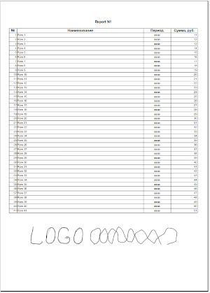
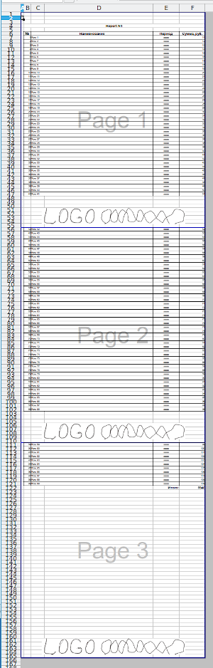

# ClosedXML.Report.Footer
Расширение для библиотеки [ClosedXML.Report](https://github.com/ClosedXML/ClosedXML.Report), позволяющее выводить картику в подвале на каждом листе при печати.

## Возможности

* Возможность задать внешний вид подвала в нужных размерах на отдельной странице.
* Автоматическое определение конца страницы или указать вручную строку вставки подвала.

## Как использовать?

1. В шаблоне создать лист Footer
2. Добавить в ячейку листа Footer A2 <<Delete>>
3. Скопировать структуру колонок с исходного листа для правильного расчета высоты подвала
4. Выделить область которая должна быть подвалом и задать ей имя Footer
5. Разместить изображение в области подвала в нужном размере и положении 
6. На основном листе шабона в столбце A2 добавить <<Footer>>

[Пример шаблона / template example](Test/template_1.xlsx)

**Результат**

